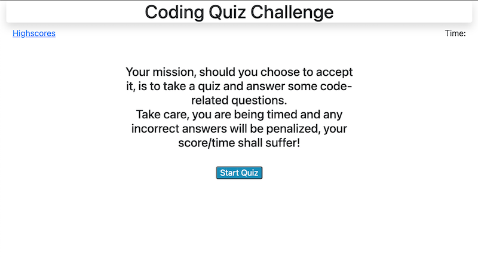

# hw4-code_quiz

## Description
    A JavaScript powered timed, multiple choice, Code Quiz that dynamically updates HTML and CSS, 
    as well as utilizes localStorage to store Highscores in the users system. jQuery was used to select elements  
    in the HTML and dynamically make changes.

## Site Screenshot
   
   
   

## Site Link
   Link to [Code Quiz](https://takolad.github.io/hw4-code_quiz/).
